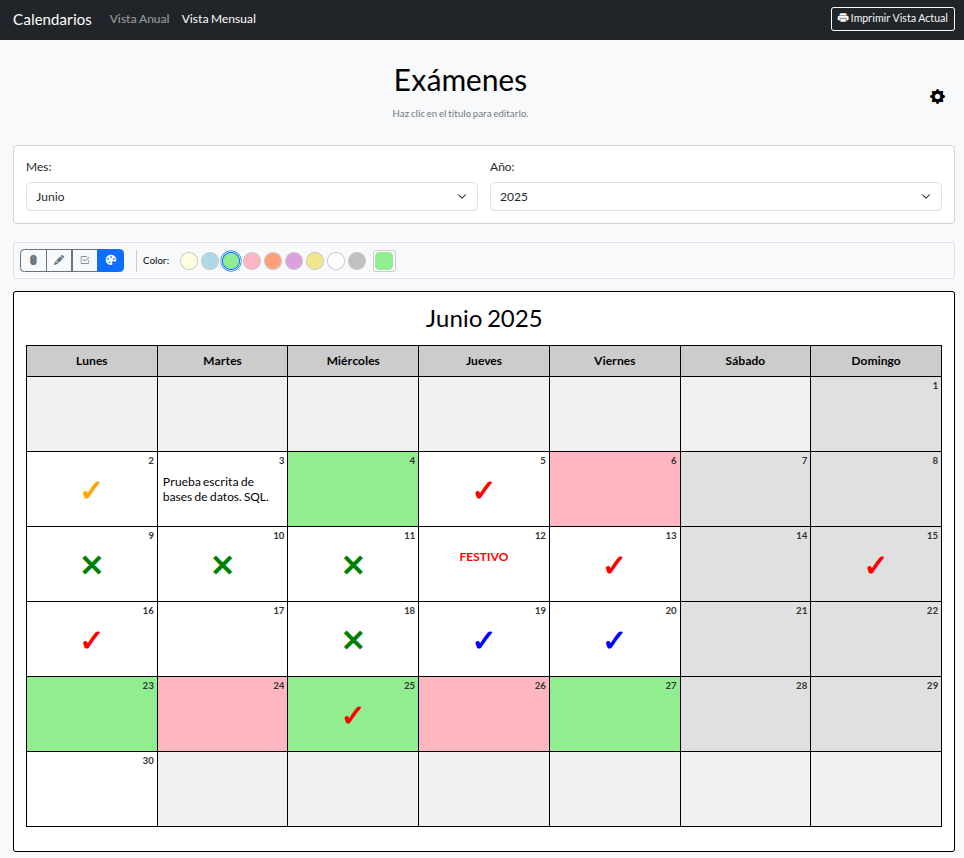

# 📅 School Calendar Generator

[](https://opensource.org/licenses/MIT) [](https://soyunomas.github.io/school-calendar-generator/index.html) <!-- Asegúrate que esta URL sea correcta después de desplegar en GitHub Pages -->

Una herramienta web para generar calendarios escolares personalizables y listos para imprimir. 🖨️

## 📝 Descripción Breve

Este proyecto proporciona una interfaz web interactiva para crear calendarios escolares en dos formatos principales: una vista anual compacta (ideal para visión general del año escolar o año completo) y una vista mensual detallada y personalizable para poder escribir dentro. Permite ajustar la apariencia visual (temas, fuentes, grosor de línea), configurar opciones funcionales (como el día de inicio de la semana) y generar versiones optimizadas para impresión directamente desde el navegador.

## 🖼️ Captura de Pantalla / Demo

 

Puedes probar la demo en vivo aquí:

*   **[Demo - Ver Generador](https://soyunomas.github.io/school-calendar-generator/index.html)**

## ✨ Características Principales

*   **📅 Dos Vistas Principales:** Genera calendarios en vista **Anual** (compacta) o **Mensual** (detallada).
*   **🎒 Modo Año Escolar (Anual):** Opción para visualizar y generar el calendario anual enfocado en el periodo escolar (ej., Septiembre - Junio).
*   **🗓️ Modo Año Completo (Anual):** Opción para visualizar y generar el calendario de Enero a Diciembre del año seleccionado.
*   **🎨 Personalización Visual (Mensual):**
    *   Elige entre múltiples **temas de color** (Alto Contraste, Claro, Pasteles variados).
    *   Ajusta el **grosor de las líneas** de la tabla.
    *   Selecciona diferentes **fuentes** (Lato, Roboto, Montserrat, etc.).
*   **⚙️ Ajustes Funcionales (Mensual):**
    *   Configura el **primer día de la semana** (Lunes o Domingo).
    *   Activa o desactiva el **resaltado visual de fines de semana**.
*   **✏️ Títulos Editables:** Personaliza el título principal tanto en la vista anual como mensual haciendo clic directamente sobre él.
*   **💾 Persistencia de Ajustes (Mensual):** Guarda tus preferencias de estilo y funcionalidad (tema, fuente, grosor, etc.) en el almacenamiento local (`localStorage`) para futuras visitas.
*   **📄 Optimizado para Impresión:** Estilos CSS específicos (`@media print`) para generar calendarios limpios y legibles:
    *   Vista Mensual: Formato apaisado, intentando replicar los estilos visuales seleccionados (colores de cabecera, bordes, etc., sujeto a la impresora).
    *   Vista Anual: Formato vertical, mostrando los meses seleccionados de forma compacta.
*   **📱 Diseño Responsivo:** Interfaz adaptable a diferentes tamaños de pantalla gracias a Bootstrap.
*   **🧩 Código Autónomo:** Aplicación completa contenida en un único archivo HTML (`code(255).html`) con CSS y JavaScript incrustados para mayor simplicidad.

## 🛠️ Tecnologías Utilizadas

*   **HTML5:** Estructura semántica del contenido.
*   **CSS3:** Estilos personalizados, variables CSS para theming, `@media print` para estilos de impresión.
*   **Bootstrap 5.3.x:** Framework CSS/JS para layout responsivo, componentes (modal, navbar, grid, formularios) y utilidades.
*   **Bootstrap Icons:** Iconografía utilizada en la interfaz (ej., icono de configuración, impresora).
*   **JavaScript (ES6+):** Lógica de la aplicación:
    *   Generación dinámica de calendarios (anual y mensual).
    *   Manipulación del DOM.
    *   Gestión de eventos (cambios en selectores, clics, edición de títulos).
    *   Gestión de configuración (modal de ajustes).
    *   Uso de `localStorage` para guardar preferencias.
    *   Lógica de fechas.
*   **Google Fonts:** Para ofrecer variedad de fuentes (Lato, Roboto, Montserrat).
*   **CDNs:** Bootstrap (CSS y JS), Bootstrap Icons y Google Fonts se cargan desde CDNs.

## 🚀 Instalación / Visualización Local

Este proyecto es una aplicación web estática puramente del lado del cliente. No requiere backend ni procesos de build complejos. Para ejecutarla localmente:

1.  **Clona el repositorio:**
    ```bash
    git clone https://github.com/soyunomas/school-calendar-generator.git
    ```
2.  **Navega al directorio del proyecto:**
    ```bash
    cd school-calendar-generator
    ```
3.  **Abre el archivo HTML principal:**
    *   Abre el archivo `code(255).html` directamente en tu navegador web preferido (Chrome, Firefox, Edge, Safari, etc.).
4.  **🌐 Conexión a Internet:** Es necesaria la primera vez (o si limpias la caché) para cargar Bootstrap, Bootstrap Icons y Google Fonts desde sus respectivos CDNs.
5.  **(Sin Dependencias Adicionales):** No se requiere instalación de Node.js, servidores locales (aunque puedes usar uno si lo prefieres, como Live Server de VS Code) ni ninguna otra configuración compleja.

## 🕹️ Cómo Usar

1.  **Seleccionar Vista:** Utiliza los enlaces "Vista Anual" y "Vista Mensual" en la barra de navegación superior para cambiar entre los dos modos de generación.
2.  **Configurar Vista Anual:**
    *   Introduce el **año de inicio** deseado en el campo numérico.
    *   Selecciona si prefieres ver el "Año Escolar" (Sep-Jun del año siguiente) o el "Año Completo" (Ene-Dic del año seleccionado). El calendario se actualizará automáticamente.
    *   **Editar Título:** Haz clic sobre el título "Calendario Anual" (o el texto que tenga) para modificarlo. Presiona Enter o haz clic fuera para guardar el cambio (solo visual, no se guarda permanentemente).
    *   **Imprimir:** Usa el botón "<i class="bi bi-printer-fill"></i> Imprimir Vista Actual" en la barra de navegación.
3.  **Configurar Vista Mensual:**
    *   Selecciona el **Mes** y el **Año** deseados usando los menús desplegables. El calendario se generará automáticamente.
    *   **Editar Título:** Haz clic sobre el título "Calendario Mensual Personalizable" (o el texto que tenga) para modificarlo. Este título **sí se guarda** en la configuración local.
    *   **Abrir Configuración:** Haz clic en el icono de engranaje (<i class="bi bi-gear-fill"></i>) en la esquina superior derecha para abrir el modal de "Configuración y Estilos".
    *   **Ajustar Opciones:** Dentro del modal, puedes cambiar:
        *   *Funcionalidad:* Primer día de la semana, resaltar fines de semana.
        *   *Apariencia:* Tema de color, grosor de línea, fuente.
    *   **Guardar Configuración:** Haz clic en "Guardar y Aplicar" en el modal. Los cambios se aplicarán al calendario y se guardarán en `localStorage` para tu próxima visita.
    *   **Imprimir:** Usa el botón "<i class="bi bi-printer-fill"></i> Imprimir Vista Actual". Los estilos visuales (tema, grosor de línea, fuente) configurados se aplicarán a la versión impresa (la fidelidad del color dependerá de la impresora y su configuración).
4.  **Impresión General:** El botón de impresión en la barra de navegación siempre imprimirá la vista (Anual o Mensual) que esté activa en ese momento.

## 📄 Licencia

Este proyecto está bajo la Licencia MIT.
[](https://opensource.org/licenses/MIT)

## 🧑‍💻 Contacto

Creado por **soyunomas** ([@soyunomas en GitHub](https://github.com/soyunomas))

---
