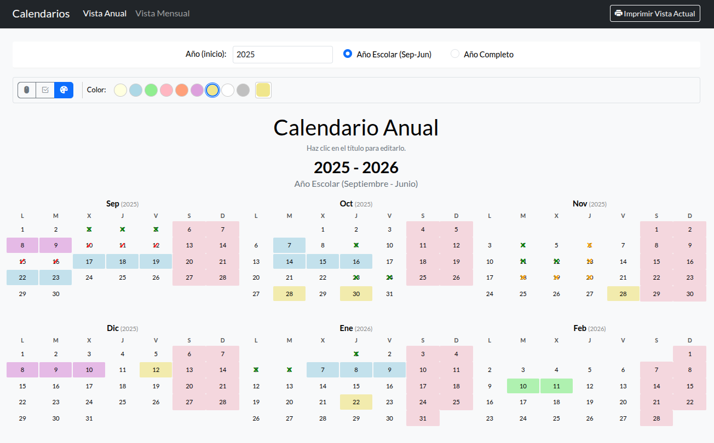

# 📅 Generador de Calendarios Escolares y Mensuales Personalizables

[](https://opensource.org/licenses/MIT) [](https://soyunomas.github.io/school-calendar-generator/index.html) <!-- Asegúrate que esta URL sea correcta después de desplegar en GitHub Pages -->

Una herramienta web para generar calendarios escolares y mensuales personalizables, con opciones de anotación y listos para imprimir. 🖨️

## 📝 Descripción Breve

Este proyecto proporciona una interfaz web interactiva para crear calendarios en dos formatos principales: una vista anual compacta (ideal para visión general del año escolar o año completo) y una vista mensual detallada y personalizable. Permite realizar anotaciones directamente sobre los días (texto, marcas, colores de fondo), ajustar la apariencia visual (temas, fuentes, grosor de línea), configurar opciones funcionales (como el día de inicio de la semana) y generar versiones optimizadas para impresión directamente desde el navegador.

## 🖼️ Captura de Pantalla / Demo

* Captura de pantalla del calendario para rellenar en papel.

 

* El calendario escolar comenzando en septiembre. 

 

Puedes probar la demo en vivo aquí:

*   **[Demo - Ver Generador](https://soyunomas.github.io/school-calendar-generator/index.html)**

## ✨ Características Principales

*   **📅 Dos Vistas Principales:**
    *   **Vista Anual:** Compacta, ideal para una visión general.
        *   **Modo Año Escolar:** Configurable para el periodo escolar (ej., Septiembre - Junio del año siguiente).
        *   **Modo Año Completo:** Visualiza de Enero a Diciembre del año seleccionado.
    *   **Vista Mensual:** Detallada, diseñada para anotaciones y mayor personalización.

*   **✏️ Herramientas de Anotación:**
    *   **Cursor:** Herramienta por defecto para navegación.
    *   **Lápiz (Solo Vista Mensual):**
        *   Añade y edita texto directamente en las celdas de los días.
        *   Opciones de formato: Fuente, tamaño de fuente, color de texto.
        *   Estilos de texto: Negrita, cursiva.
        *   Alineación de texto: Horizontal (izquierda, centro, derecha) y Vertical (arriba, medio, abajo).
    *   **Marcas (Vista Anual y Mensual):**
        *   Añade símbolos predefinidos (ej., ✓, ✕) a las celdas.
        *   Selección del tipo de marca.
        *   Selección del color de la marca.
    *   **Color de Fondo (Vista Anual y Mensual):**
        *   Rellena el fondo de las celdas con un color.
        *   Paleta de colores predefinidos para acceso rápido.
        *   Selector de color personalizado.
    *   **Selección Múltiple con Shift (Marcas y Fondo):**
        *   En ambas vistas, al usar las herramientas de Marcas o Color de Fondo, mantén presionada la tecla `Shift` al hacer clic en una segunda celda para aplicar la anotación a todo el rango de días entre el primer clic (ancla) y el segundo.

*   **🎨 Personalización Visual (Principalmente Vista Mensual):**
    *   Elige entre múltiples **temas de color** (Alto Contraste, Claro, Pasteles variados).
    *   Ajusta el **grosor de las líneas** de la tabla del calendario.
    *   Selecciona diferentes **fuentes** (Lato, Roboto, Montserrat, etc.).

*   **⚙️ Ajustes Funcionales (Vista Mensual):**
    *   Configura el **primer día de la semana** (Lunes o Domingo).
    *   Activa o desactiva el **resaltado visual de fines de semana**.

*   **✍️ Títulos Editables:**
    *   Personaliza el título principal tanto en la vista anual como mensual haciendo clic directamente sobre él. Los cambios se guardan localmente.

*   **💾 Persistencia de Datos (`localStorage`):**
    *   **Ajustes de Vista Anual:** Año de inicio, tipo de vista (escolar/completo) y título.
    *   **Ajustes de Vista Mensual:** Mes y año actuales, todas las configuraciones del modal (tema, fuente, grosor, inicio de semana, resaltado de findes) y título.
    *   **Anotaciones:** Todas las anotaciones (texto, marcas, colores de fondo) realizadas en ambas vistas se guardan para que persistan entre sesiones.

*   **📄 Optimizado para Impresión:** Estilos CSS específicos (`@media print`) para generar calendarios limpios y legibles:
    *   **Vista Mensual:** Formato apaisado, intentando replicar los estilos visuales y anotaciones.
    *   **Vista Anual:** Formato vertical, mostrando los meses seleccionados de forma compacta, con anotaciones. El subtítulo informativo (ej. "Año Escolar") se oculta en la impresión. Margen vertical entre meses ajustado para impresión apaisada.
    *   Elementos de interfaz (botones, selectores, etc.) se ocultan automáticamente.

*   **📱 Diseño Responsivo:** Interfaz adaptable a diferentes tamaños de pantalla gracias a Bootstrap.

*   **🧩 Código Autónomo:** Aplicación completa contenida en un único archivo HTML (`index.html` o similar) con CSS y JavaScript incrustados para mayor simplicidad.

## 🛠️ Tecnologías Utilizadas

*   **HTML5:** Estructura semántica del contenido.
*   **CSS3:** Estilos personalizados, variables CSS para theming, `@media print` para estilos de impresión, Flexbox y Grid para layout.
*   **Bootstrap 5.3.x:** Framework CSS/JS para layout responsivo, componentes (modal, navbar, grid, formularios, tooltips) y utilidades.
*   **Bootstrap Icons:** Iconografía utilizada en la interfaz.
*   **JavaScript (ES6+):** Lógica de la aplicación:
    *   Generación dinámica de calendarios (anual y mensual).
    *   Manipulación del DOM y gestión de eventos.
    *   Lógica de herramientas de anotación (lápiz, marcas, color de fondo).
    *   Implementación de selección de rango con Shift.
    *   Gestión de configuración y persistencia de datos mediante `localStorage`.
    *   Manejo de fechas y lógica de calendario.
*   **Google Fonts:** Para ofrecer variedad de fuentes (Lato, Roboto, Montserrat).
*   **CDNs:** Bootstrap (CSS y JS), Bootstrap Icons y Google Fonts se cargan desde CDNs para facilitar la distribución.

## 🚀 Instalación / Visualización Local

Este proyecto es una aplicación web estática puramente del lado del cliente. No requiere backend ni procesos de build complejos. Para ejecutarla localmente:

1.  **Clona el repositorio (o descarga el archivo HTML):**
    ```bash
    git clone https://github.com/soyunomas/school-calendar-generator.git
    cd school-calendar-generator
    ```
    O simplemente descarga el archivo `index.html` (o el nombre que tenga el archivo principal).
2.  **Abre el archivo HTML principal:**
    *   Abre el archivo (`index.html` o similar) directamente en tu navegador web preferido (Chrome, Firefox, Edge, Safari, etc.).
3.  **🌐 Conexión a Internet:** Es necesaria la primera vez (o si limpias la caché del navegador) para cargar Bootstrap, Bootstrap Icons y Google Fonts desde sus respectivos CDNs.
4.  **(Sin Dependencias Adicionales):** No se requiere instalación de Node.js, servidores locales (aunque puedes usar uno si lo prefieres, como la extensión "Live Server" de VS Code) ni ninguna otra configuración compleja.

## 🕹️ Cómo Usar

1.  **Seleccionar Vista:** Utiliza los enlaces "Vista Anual" y "Vista Mensual" en la barra de navegación superior.
2.  **Vista Anual:**
    *   **Configurar Periodo:** Introduce el **año de inicio** y selecciona "Año Escolar" o "Año Completo". El calendario se actualizará.
    *   **Editar Título:** Haz clic sobre el título "Calendario Anual" para modificarlo. El cambio se guarda.
    *   **Herramientas de Anotación (Marcas, Color de Fondo):**
        *   Selecciona la herramienta "Marcas" (<i class="bi bi-check2-square"></i>) o "Fondo" (<i class="bi bi-palette-fill"></i>) en la barra de herramientas.
        *   Configura las opciones de la herramienta (tipo/color de marca, color de fondo).
        *   **Clic simple:** Aplica/elimina la anotación en una celda. Establece el ancla para selección con Shift.
        *   **Shift + Clic:** Con una herramienta de Marcas o Fondo activa y un ancla establecida, mantén `Shift` y haz clic en otra celda para aplicar la anotación a todo el rango de días.
    *   **Imprimir:** Usa el botón "<i class="bi bi-printer-fill"></i> Imprimir Vista Actual".

3.  **Vista Mensual:**
    *   **Seleccionar Mes y Año:** Usa los menús desplegables. El calendario se generará.
    *   **Editar Título:** Haz clic sobre el título "Calendario Mensual Personalizable" para modificarlo. El cambio se guarda.
    *   **Abrir Configuración (<i class="bi bi-gear-fill"></i>):**
        *   *Funcionalidad:* Primer día de la semana, resaltar fines de semana.
        *   *Apariencia:* Tema, grosor de línea, fuente.
        *   Guarda los cambios; se aplicarán y persistirán.
    *   **Herramientas de Anotación:**
        *   **Lápiz (<i class="bi bi-pencil-fill"></i>):**
            *   Selecciona la herramienta y configura fuente, tamaño, color, estilo y alineación.
            *   Haz clic en una celda para empezar a escribir. El texto se guarda al perder el foco.
            *   La alineación vertical del texto se aplica al contenedor del texto dentro de la celda.
        *   **Marcas (<i class="bi bi-check2-square"></i>) y Color de Fondo (<i class="bi bi-palette-fill"></i>):**
            *   Funcionan igual que en la Vista Anual, incluyendo la selección con Shift.
    *   **Imprimir:** Usa el botón "<i class="bi bi-printer-fill"></i> Imprimir Vista Actual".

4.  **Impresión General:** El botón de impresión en la barra de navegación siempre imprimirá la vista (Anual o Mensual) que esté activa.

## 📄 Licencia

Este proyecto está bajo la Licencia MIT.
[](https://opensource.org/licenses/MIT)

## 🧑‍💻 Contacto

Creado por **soyunomas** ([@soyunomas en GitHub](https://github.com/soyunomas))

---
